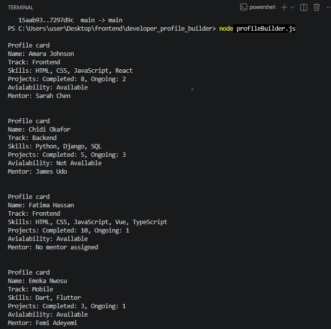
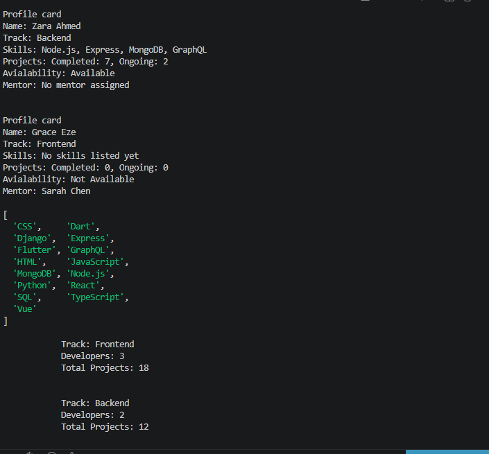
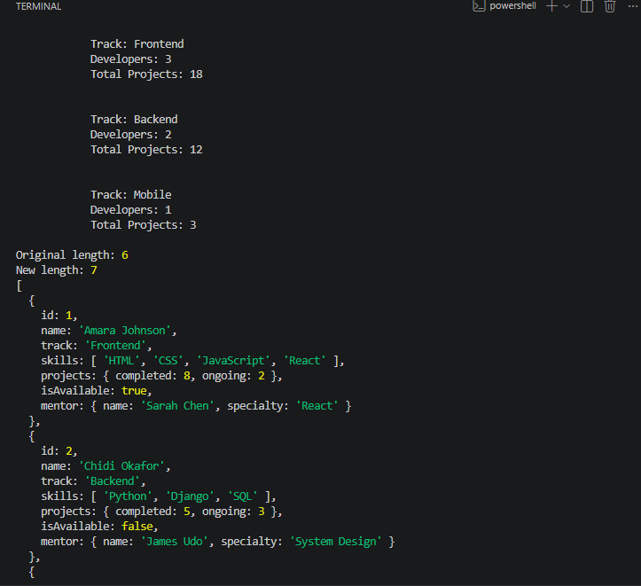
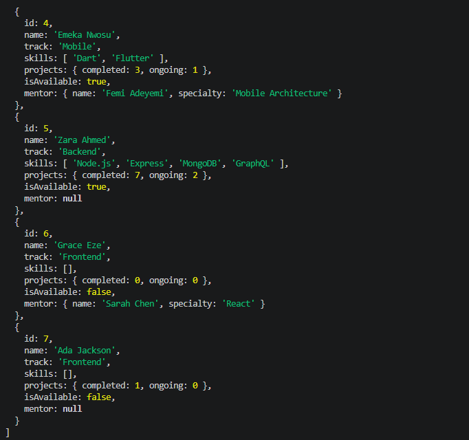
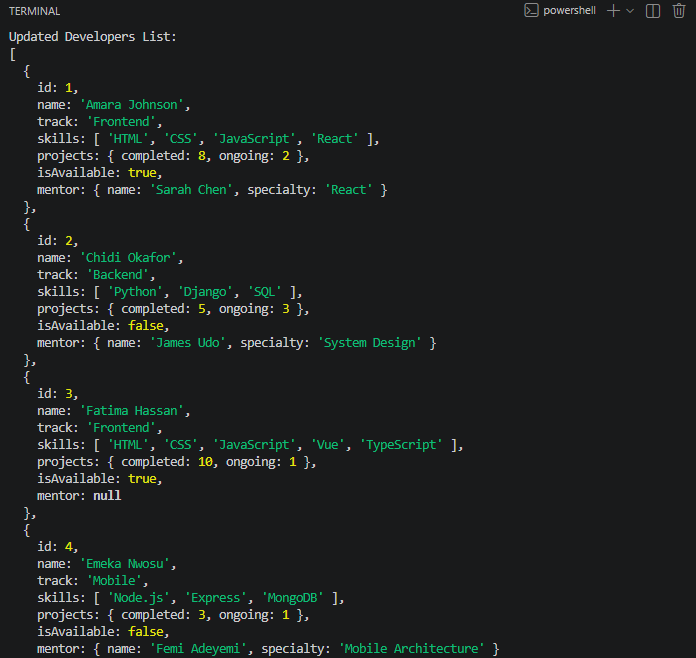
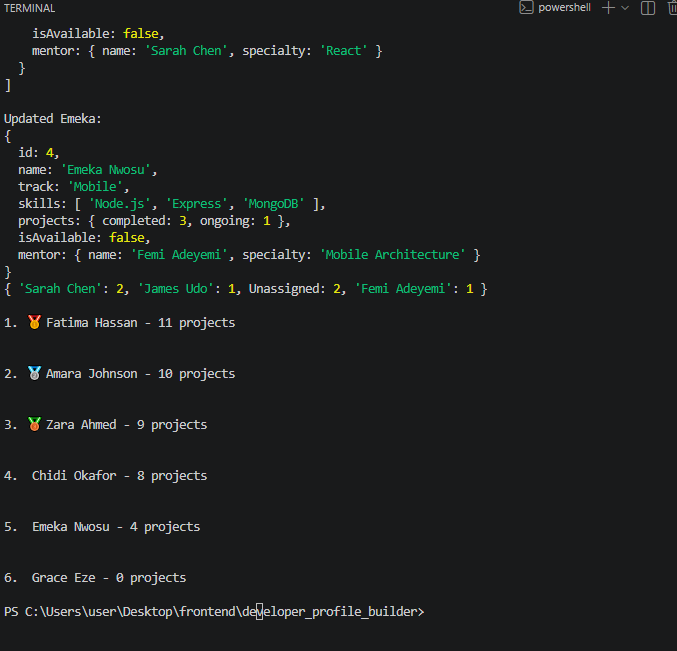

# Developer_Profile_Builder

Task by Ladunni Tegbe

Student ID: KC-STD-6063

React

Intermediate


## How to Run the File

1. Make sure Node.js is installed on your computer.

2. Open the project folder in VS Code.

3. Open the terminal.

4. Run the file using:

```bash
node profileBuilder.js

###  Screenshots







